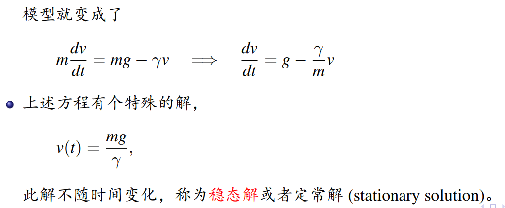
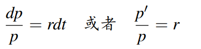
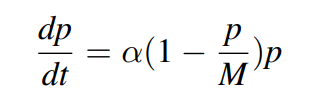
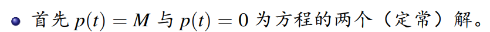
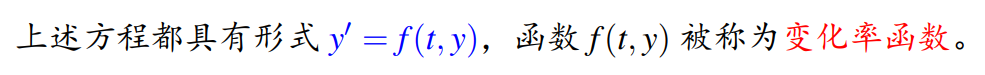
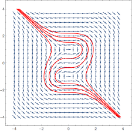
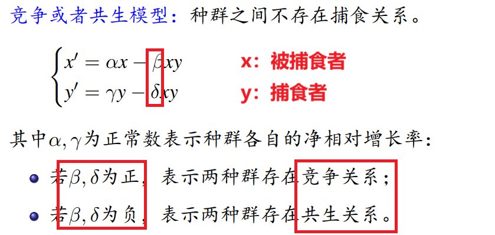
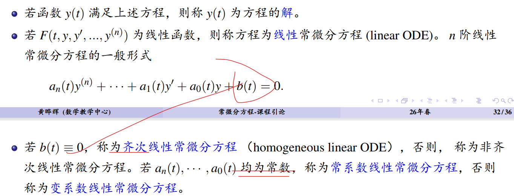

### 常微分方程

#### 名词解释
通解 + 定解条件 = 特解
唯一解 = 特解； 稳态解 = 定常解

##### 人口模型
指数增长：Malthus模型；

存在生存空间约束：Verhulst模型（=Logistic）；

补充：
裂项积分
1/(x-a)*(x-b) = 1/(b-a)*(1/(x-a)-1/(x-b))

自治方程（待补充）

解题思路：
1. 通过“观察法”先筛选出“定常解”，Ex.在人口增长模型，使得增长率=0，对于Verhulst模型

2. 变量分离两边积分
3. 通解--特解

##### 变化率方程 y' = f(y,t)

##### 方向图_流线

<video controls src="Direction_Graph.mp4" title="Title"></video>

##### 种群生态模型（Lotka-Volterra）

##### 传染病模型
SI，SIR模型
补充：一般除种群生态模型定常解好求解，其余的都需通过相图（Phase Diagram）表达求解

##### N体问题

##### 常微分方程分类

线性，齐次，常系数，非齐次，可降阶，伯努利，线性可变系数，非线性，偏微分方程，自治（少见：运输，热）

