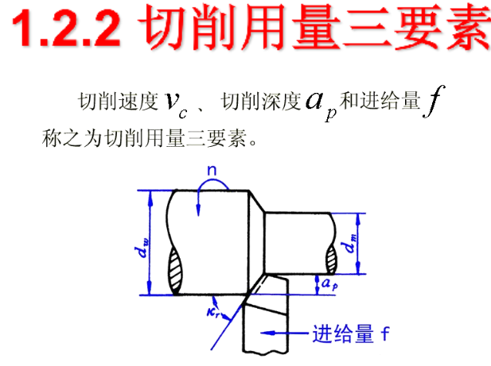
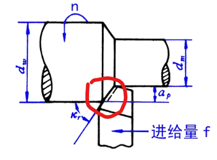
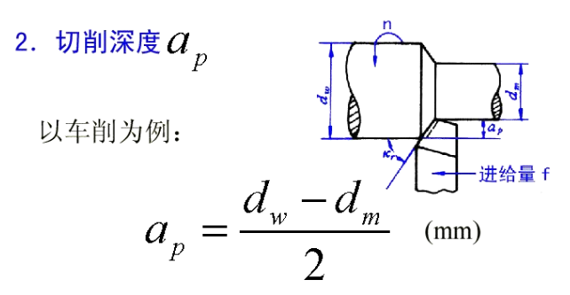
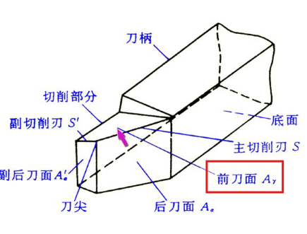

# 2.3 金属切屑

## 1.2 加工表面三要素

### 主运动
刀具切屑的运动

### 进给运动
相对移动方向来完成切屑运动

## 切屑参数
切屑速度 v_c、切屑深度 a_p、进给量 f



### 切屑速度 v_c

**定义：** 切屑刀刃上速度最大的点（外径最大的地方）



**备注：** d_w、d_m 单位都是 mm

**公式：**
```
v_c = π × d × n / 1000 （单位：m/s 或 m/min）
```

### 切屑深度 a_p



### 进给量 f

**定义：** 进给量 f = 回转一圈，刀具所进给的相对位移（mm）

**公式：**
```
v_f = f × n （单位：m/s 或 m/min）
```

#### 每齿进给量（z 齿）
```
v_f = f_z × z × n
```
每齿 = 转 1/z 圈（进 1 个齿）

#### 效率（三要素乘积）
三要素乘积 = 梯形面积 × 切屑速度 = 体积


---

## 1.3 刀具角度参数

**分类：** 直角切屑、斜角切屑



### 刀具结构组成

- **前刀面 A_γ**：刀具切屑流过的面
- **后刀面 A_α**：相对于加工面的斜面
- **副后刀面 A_α'**：后刀面隔壁

**三面两刃一刀 = 刀尖**
