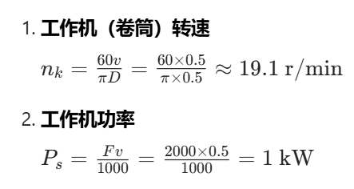
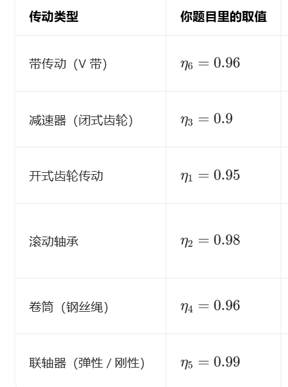
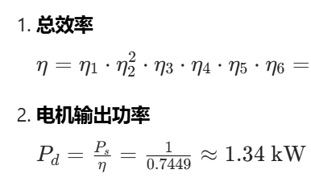
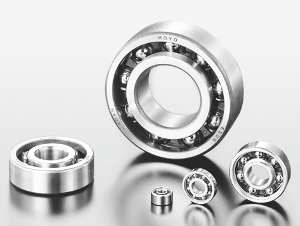
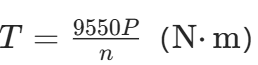

# 💡解答 Q2-5（做成HTML时用子窗口存放完整解答）

## 一、工作机参数计算
已知：\( F = 2000\ \mathrm{N} \)，\( D = 500\ \mathrm{mm} = 0.5\ \mathrm{m} \)，\( v = 0.5\ \mathrm{m/s} \)，\( n_1 = 960\ \mathrm{r/min} \)

1.  **工作机（卷筒）转速**
    \[
    n_k = \frac{60v}{\pi D} = \frac{60 \times 0.5}{\pi \times 0.5} \approx 19.1\ \mathrm{r/min}
    \]
2.  **工作机功率**
    \[
    P_s = \frac{Fv}{1000} = \frac{2000 \times 0.5}{1000} = 1\ \mathrm{kW}
    \]

---

## 二、总传动比与带传动比分配
1.  **总传动比**
    \[
    i_{\text{总}} = \frac{n_1}{n_k} = \frac{960}{19.1} \approx 50.26
    \]
2.  **传动比分配**
    总传动比 \( i_{\text{总}} = i_{\text{带}} \cdot i_{\text{减}} \cdot i_{\text{齿}} \)，取 \( i_{\text{减}} = 6 \)，\( i_{\text{齿}} = 4 \)，则：
    \[
    i_{\text{带}} = \frac{i_{\text{总}}}{i_{\text{减}} \cdot i_{\text{齿}}} = \frac{50.26}{6 \times 4} \approx 2.09
    \]
    取 \( i_{\text{带}} = 2 \)，校验速度误差：
    实际卷筒转速 \( n_k' = \frac{960}{2 \times 6 \times 4} = 20\ \mathrm{r/min} \)
    \[
    \text{误差} = \left| \frac{20 - 19.1}{19.1} \right| \times 100\% \approx 4.71\% < 5\% \quad (\text{满足要求})
    \]
    故带传动比取 \( \boldsymbol{i_{\text{带}} = 2} \)。

---

## 三、各轴转速计算
- 带传动从动轴（减速器高速轴）：
  \[
  n_2 = \frac{n_1}{i_{\text{带}}} = \frac{960}{2} = 480\ \mathrm{r/min}
  \]
- 减速器低速轴（开式齿轮高速轴）：
  \[
  n_3 = \frac{n_2}{i_{\text{减}}} = \frac{480}{6} = 80\ \mathrm{r/min}
  \]
- 开式齿轮低速轴（卷筒轴）：
  \[
  n_k' = \frac{n_3}{i_{\text{齿}}} = \frac{80}{4} = 20\ \mathrm{r/min} \quad (\text{与校验结果一致})
  \]

---

## 四、总效率与电机输出功率
已知各传动效率：
\( \eta_1 = 0.95 \)（开式齿轮），\( \eta_2 = 0.98 \)（轴承，2对），\( \eta_3 = 0.9 \)（减速器），\( \eta_4 = 0.96 \)（卷筒），\( \eta_5 = 0.99 \)（联轴器），\( \eta_6 = 0.96 \)（带传动）

1.  **总效率**
    \[
    \eta = \eta_1 \cdot \eta_2^2 \cdot \eta_3 \cdot \eta_4 \cdot \eta_5 \cdot \eta_6 = 0.95 \times 0.98^2 \times 0.9 \times 0.96 \times 0.99 \times 0.96 \approx 0.7449
    \]
2.  **电机输出功率**
    \[
    P_d = \frac{P_s}{\eta} = \frac{1}{0.7449} \approx 1.34\ \mathrm{kW}
    \]

---

## 五、各轴转矩计算
1.  **电机轴转矩**
    \[
    T_d = 9.55 \times 10^6 \cdot \frac{P_d}{n_1} = 9.55 \times 10^6 \cdot \frac{1.34}{960} \approx 1.33 \times 10^4\ \mathrm{N \cdot mm}
    \]
2.  **带传动从动轴转矩**
    带传动从动轴功率：
    \[
    P_2 = P_d \cdot \eta_6 = 1.34 \times 0.96 \approx 1.29\ \mathrm{kW}
    \]
    \[
    T_2 = 9.55 \times 10^6 \cdot \frac{P_2}{n_2} = 9.55 \times 10^6 \cdot \frac{1.29}{480} \approx 2.57 \times 10^4\ \mathrm{N \cdot mm}
    \]

---

## 核心结论
| 项目                | 结果                          |
|---------------------|-------------------------------|
| 工作机转速 \( n_k \) | \( \approx 19.1\ \mathrm{r/min} \) |
| 工作机功率 \( P_s \) | \( 1\ \mathrm{kW} \)           |
| 总传动比 \( i_{\text{总}} \) | \( \approx 50.26 \)           |
| 带传动比 \( i_{\text{带}} \) | \( 2 \)（满足误差要求）|
| 总效率 \( \eta \)    | \( \approx 0.7449 \)          |
| 电机输出功率 \( P_d \) | \( \approx 1.34\ \mathrm{kW} \) |
| 电机轴转矩 \( T_d \) | \( \approx 1.33 \times 10^4\ \mathrm{N \cdot mm} \) |
| 带传动从动轴转矩 \( T_2 \) | \( \approx 2.57 \times 10^4\ \mathrm{N \cdot mm} \) |

---

## 解题思路
为求出“带”的传动比（i_带）
0. 预备工作，求 
1. 先求出”总传动比”
2. 总传动比是传动比i的连乘，得i_带 ，验证误差

---

## 名词解释
 P_s > P_d 因为driving > service，额定，和实际有用功（中间肯定有消耗）

---

## 知识点

，Q2-5

