# 2.5 铸造熔炼与造型材料

## 2.5.1 铸铁的熔炼

浇注温度：1400

出炉温度：1450（原先+50）

薄件出路 再+20（冷却快）

### 冲天炉（Cupola）

底焦燃烧——预热、融化、过热——冶金（氧化还原、渗硫、脱硫、脱气、脱杂）

反应结果：Fe/Mn/Si——氧化

碳C的变化↑，增硫S↑（焦碳含大量硫）∵直接和焦底直接接触

补充：熔渣如CaCO3, CaF2（非金属，氧化物）

保护，隔绝空气（防止继续氧化），去除杂质

### 含碳量（负相关）

*原先碳含量高 —— 降低；原先碳含量低 —— 碳含量升高*

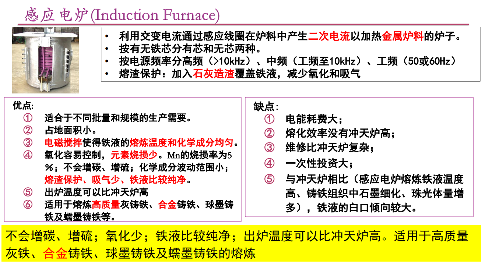

### 熔渣的酸碱

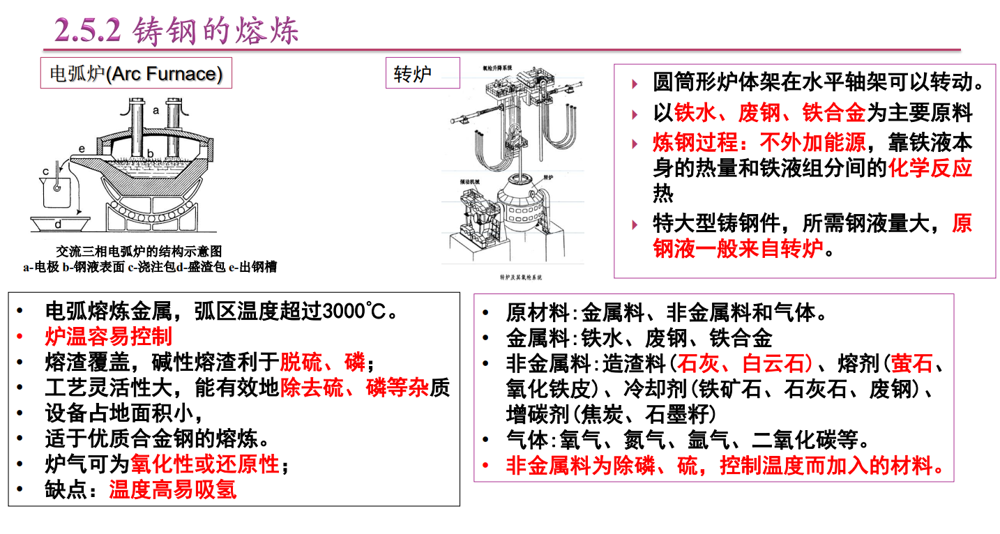

（酸性熔渣）硫的含量高，能去除更多碱性的杂志

铁液温度和成分波动大，∵焦底存在"烧损"（氧化了，或者直接融入铁液）

### 感应电炉 VS 冲天炉

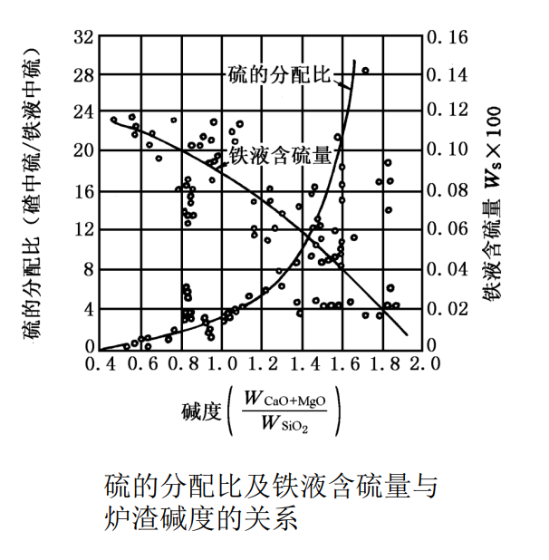

感应电炉：不会增碳增硫，氧化少，出炉温度高，成分更容易控制（电磁搅拌）

## 2. 铸铁溶体处理

复习："孕育处理"only 铸铁

球化处理：（加入镁——稀土元素）让他表面粗糙，在"螺旋面"长，形成球化

## 2.5.2 铸钢的熔炼

（！不能用冲天炉，∵碳元素需要控制）

满足浇注要求

Si/Mn/C成分控制

### 电弧炉（Arc Furnace）

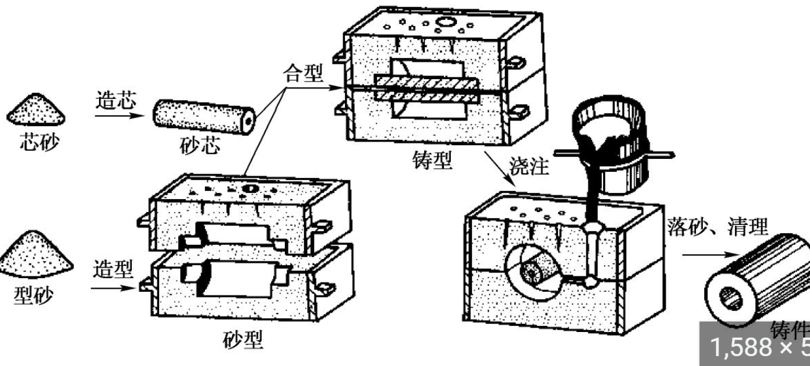

萤石=活石

氧化铁皮=氧化亚铁（Fe的氧化物）

精炼处理：降低（H\O\N\S\P）去

炉外精炼法：AOD法（氩氧脱碳精练）、VOD法（真空脱氧精练）、LF法（电弧炉精炼）

### AOD炉

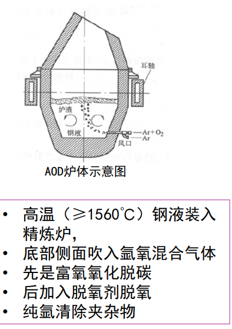

顺序：先除碳——再脱氧——其他气体（靠氩气）

氧化成CO2，脱氧剂脱氧，氩气吹走

### VOD炉（真空）

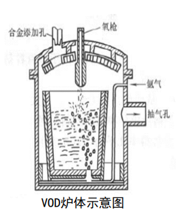

*在AOD基础上，抽真空，保护合金元素*

环境：真空，金属液气体溶解度低（往空间跑）

### LF（电弧）

## 2.5.3 铝合金的熔炼

铝合金：600

铝合金熔渣的要求：

温度合适（略低于 600）

惰性（不参与反应，氯化物KCl）

### 铝合金的炉子们

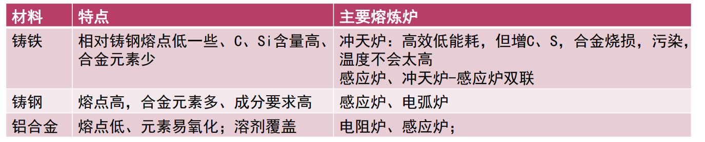

精炼处理：去除氢气（高温液体时H2溶解度大）

除H2：高压ZnCl2, C2Cl2 氯盐活氯化物

其他常见方法：输入氩气

气体：冶金反应析出，高温液体的时候溶解度高（固液溶解度差距10^18）

### 熔化及冶金处理分类

按：原料成分、铸造温度——熔化方法、对杂质的敏感

## 2.6 砂型铸造

砂型 vs 型砂（Molding Sand）这两个的区别？？

### 2.6.1 型砂材料

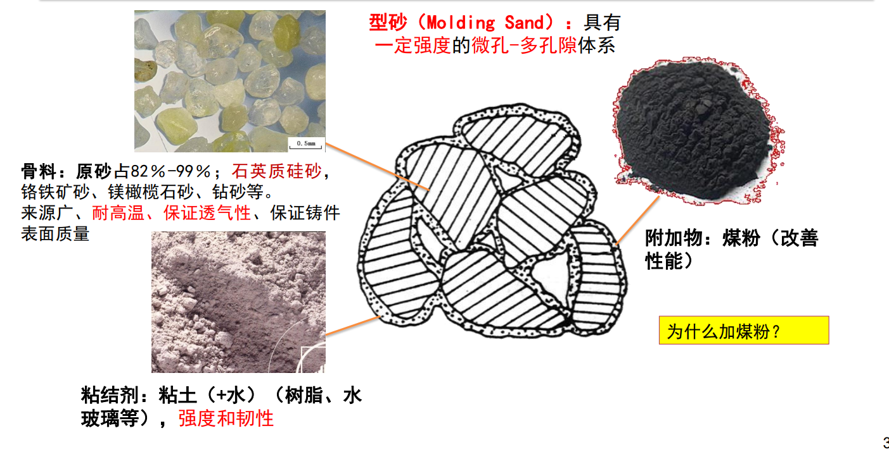

*骨料：石英质硅砂

*粘结剂：粘土+水（韧性和强度）

*（若需）附加物：煤粉（脱氧还原）

### 2.6.2 砂型铸造造型

概念：

造型（molding）：填砂——紧实——期末——修整（气孔）

紧实度：型砂被紧实的程度（不连连续体的密度）

#### 砂型铸造示意图

#### 紧实方法总结

震：下面部分

压：上面紧实

其他：带着速度填砂等等

（在修改内容，上课没听，缺失——制芯）

2.7 铸造工艺设计
2.7.1 零件工艺
避免缺陷：
-合适的壁厚（区别不大）：冷却速度不一样有Hot Pot
-铸件结构收缩不受阻碍（残余应力）
例：轮毂的收缩（过于对称的不好，会相互拉扯；奇数，做一些变化）
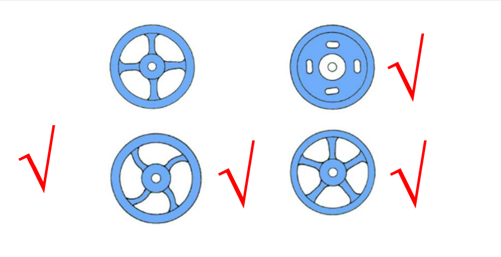
-thickness_内壁(散热慢) < thickness_外壁（散热快）
-均匀壁厚&圆角过度
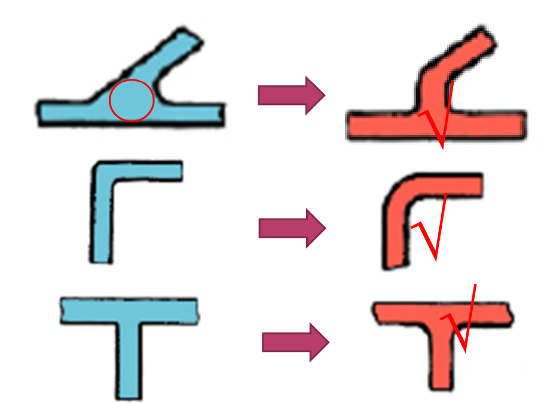
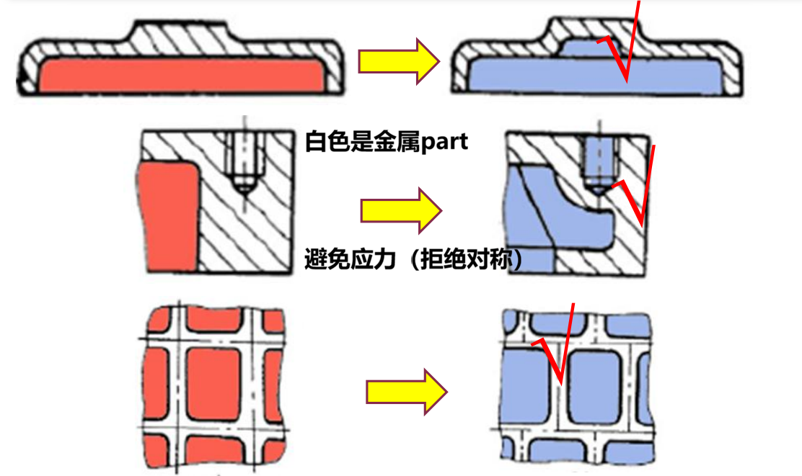
-利于补缩（顺序凝固best）
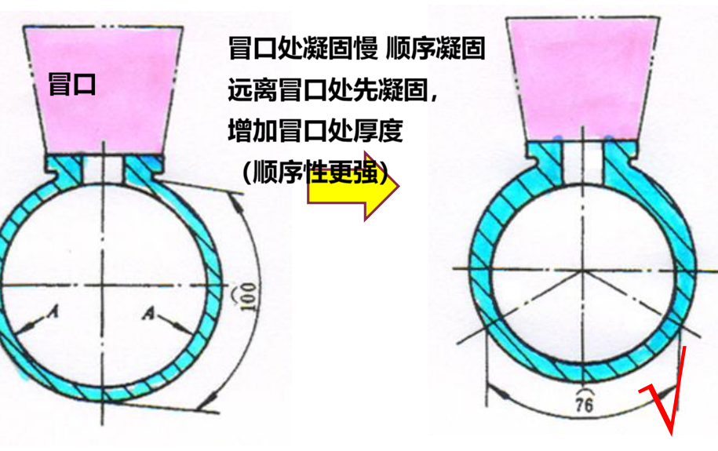
-避免浇注位置水平有过多 平面结构

简化工艺：
-减少分型面
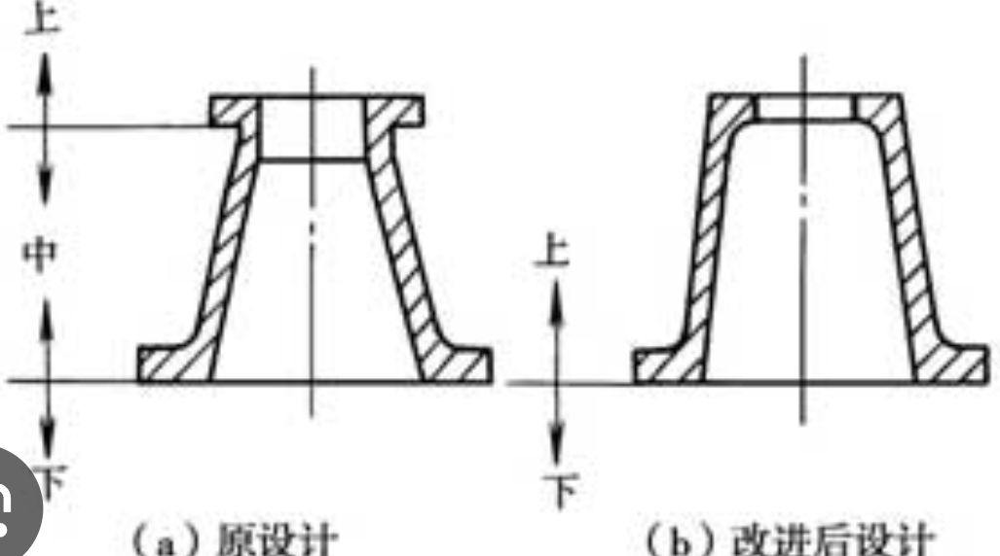
-固定和排气
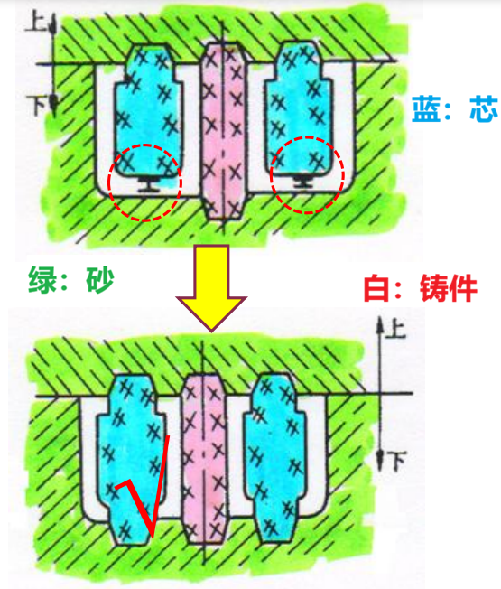
-事后清理铸件
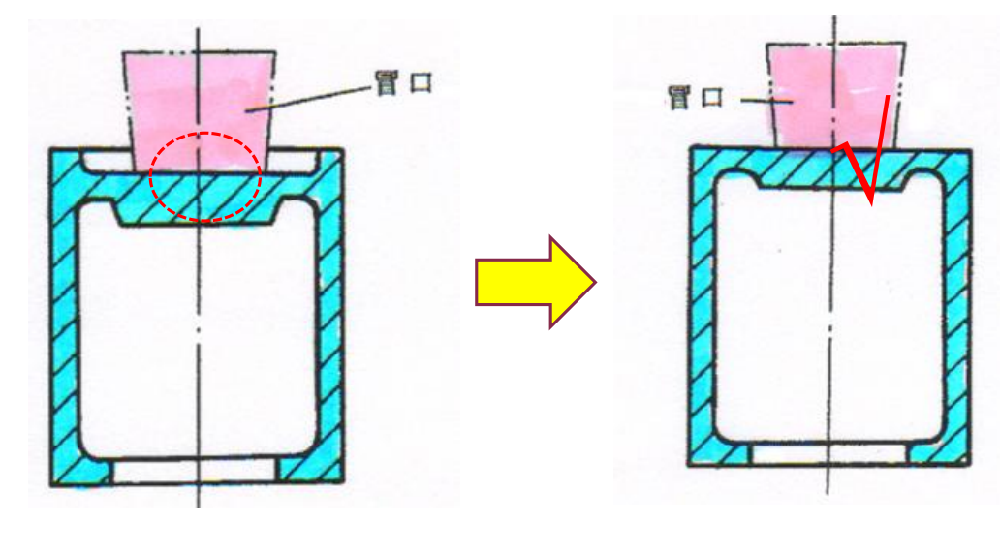
（Ex. 冒口原先在“凹坑”里）
-简化模具（使得对称）
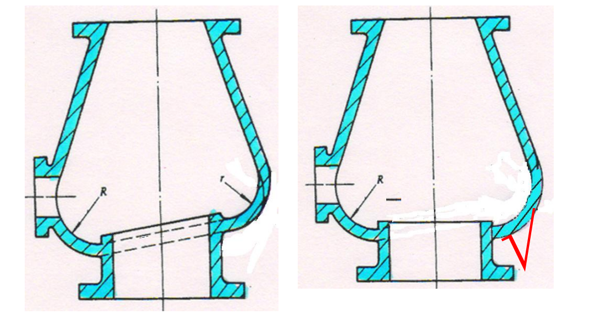
-大型的————分体铸造

补充：模样和芯盒
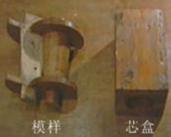
文字解释：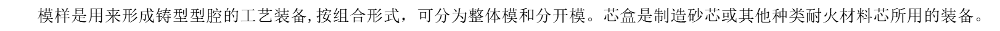，芯就是制造“连通的轴心”
（芯）的收缩量比（液体金属）小

2.7.2 造型及制芯方法
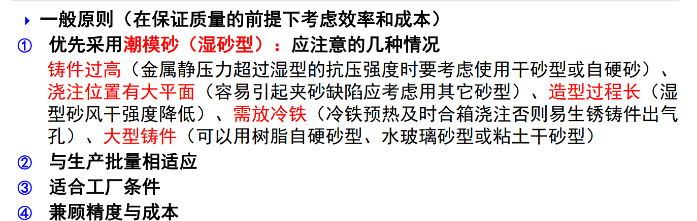
比较general

2.7.3 浇注位置确定
重要的放底部//直立，更致密（∵气体和还没溶解的往上走）
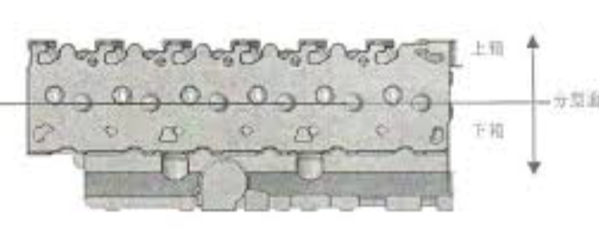
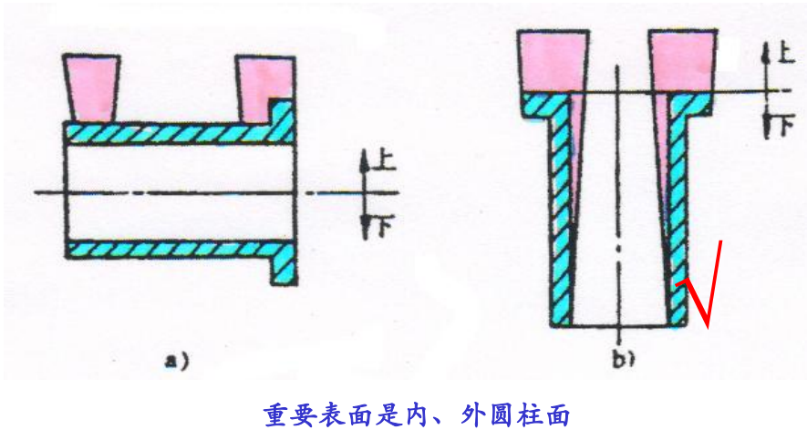
提倡：顺序补缩、利于补缩
大平面朝下（反向倾斜）*反直觉
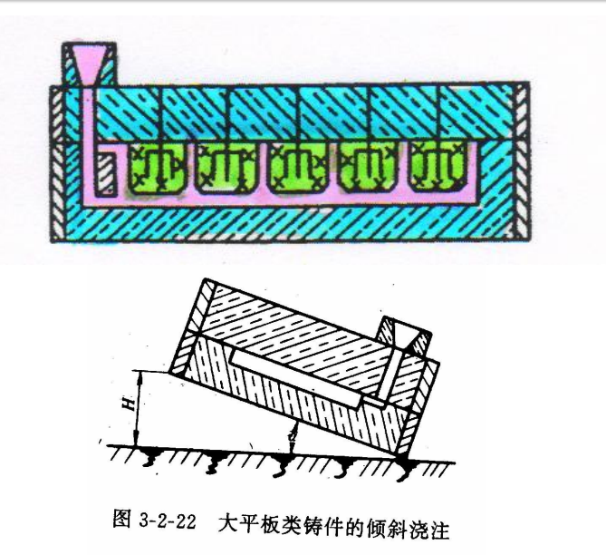
保证充满
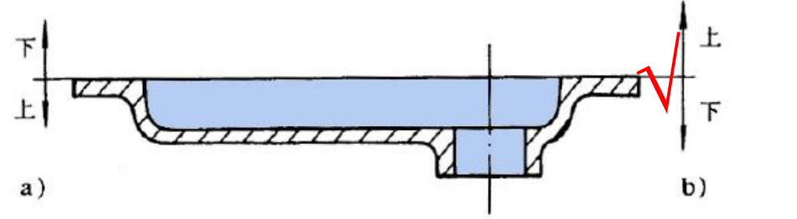
*要么反向倾斜，要么直接反着来摆
盒箱（没看懂。。）
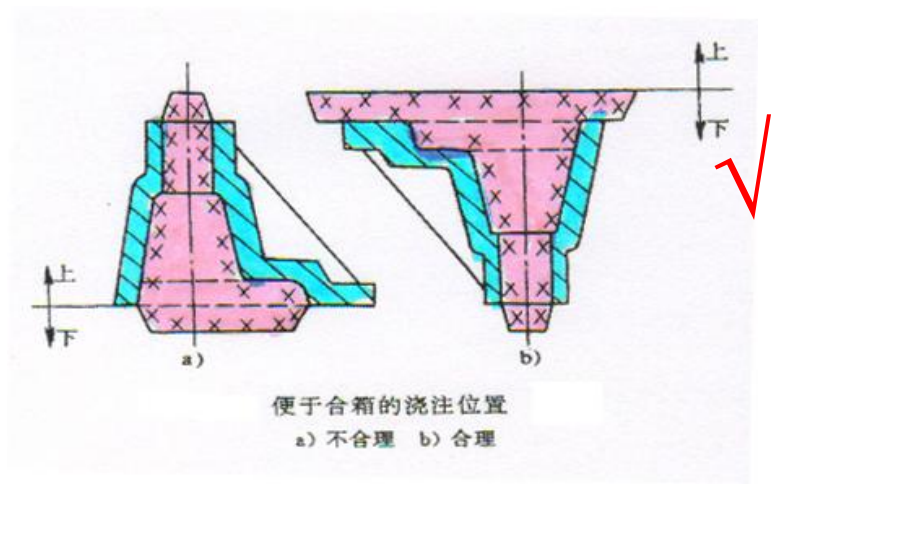

2.7.4 分型面选择
分型面定义：铸型相互接触的表面（长方体铸型，中间砍一半）
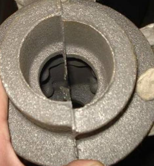
*注：分型面选择要正确：上图这样分型，圆柱不是圆柱了

选择原则：
优先平面、分型面能少就少、箱型不要过高
分模面：模型自己组合起来（复杂的组装起来，内部的模）

