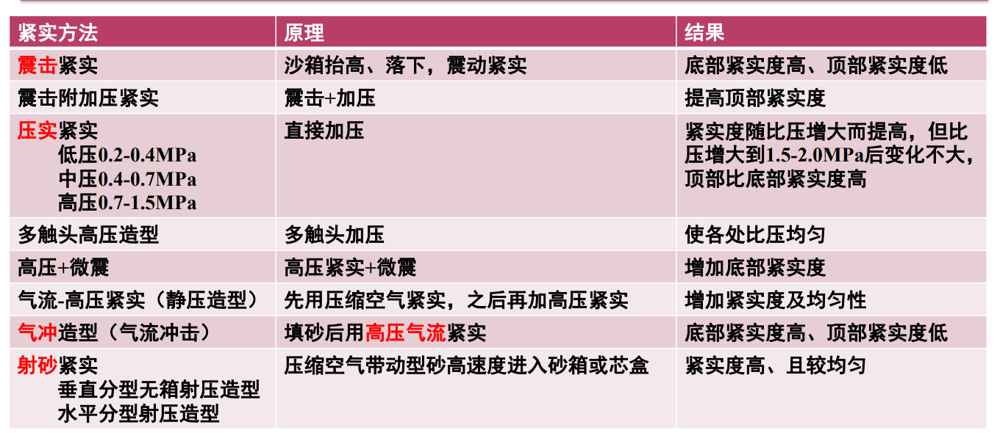
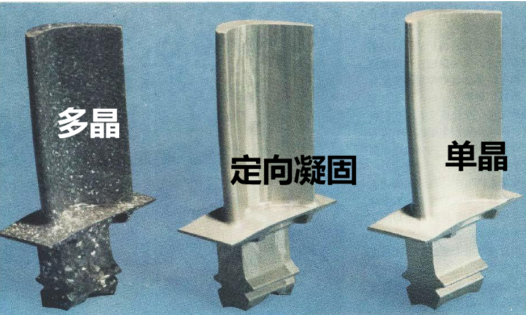
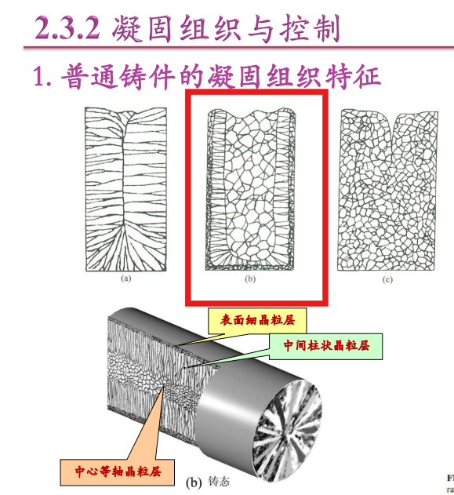
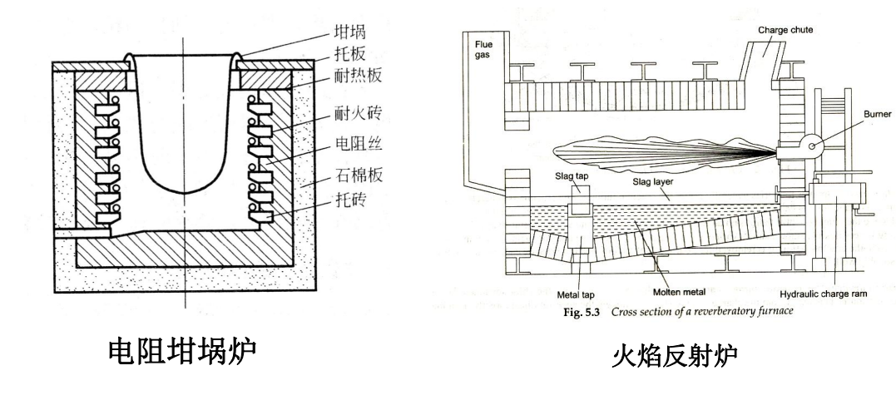
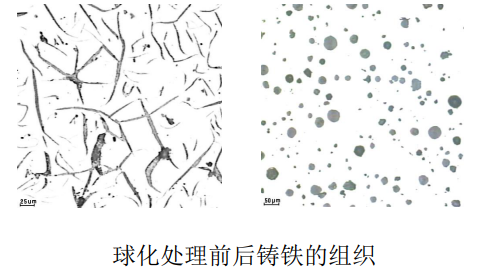
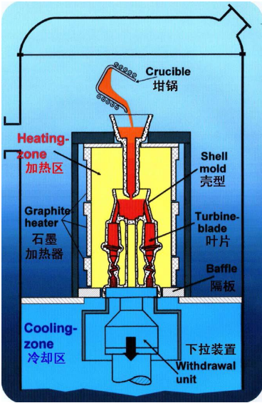
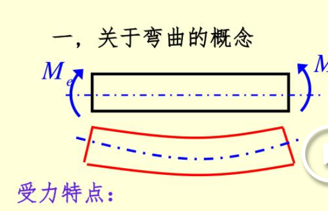
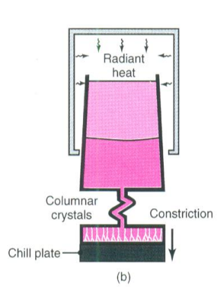
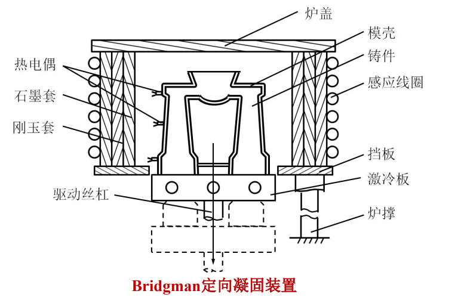

# 2.7 铸造工艺设计

## 2.7.5 加工余量

- 留金属厚度
- 粗糙度

## 3、铸件上加工孔

- 较大的孔：铸（/）
- 较小较深的孔：铸（X）加工（/）
- 弯曲孔：铸（X）
- 正方、矩阵孔：超过30mm边长 才考虑铸

## 4、起模斜度

内膜>外模（斜度）

## 6、铸造收缩率（K）

- 铸铁（C：石墨形式存在）
- 铸钢（C：碳素形式存在）
- 铸铁

## 2.7.6 浇注系统（Gating System）

### 1、浇注系统要求

- 阻渣（好）、压头（高）、利用率（>60%？）、流动（稳）、线速度（不能过高：冲坏砂型）
- 靠模样先造出浇注系统的砂型、容易处理（切断浇注系统）

### 2、类型

#### 浇注系统的各个部位介绍（缓冲3,5）

浇口杯etc

锥面（确保充满）

流体力学（质量、动量守恒）

理想情况下——v恒定（好）

最小充型时间T_mf

### 2、浇注系统的基本类型

#### （1）按"阻"流情况分

（半封闭介于二者间）

封闭 vs 开放

- 挡渣好、流速大、氧化程度大；（反之）

各种浇注系统类型的对比图

例：Mg（活泼易氧化成MgO）

选择 开放&底层（避免过度氧化）

S:Surface面积，μ：系数（实际/理论）

主"流"（主要流动）：最小的截面积（1）

对于直浇道（锥头下方，最小）

## 2.7.7 冒口冷铁

冒口分类

冒口：补缩（冒口凝固时间 ≥ 铸件）

"补贴"：在铸件上贴一块

冒口位置：

- 热节旁边/上方/侧方
- 最厚最大的位置
- 避开重要/受力大的部位

"模数"——V/A（体积/面积：当量厚度）——体现：凝固时间

Convention参数

冷铁（Chill）bro should be冷铁

- 加速冷却（防止缩孔缩松、裂纹）
- 减轻"偏析"

补充"偏析"

外冷铁 vs 内冷铁

外冷铁（在模具/芯外边）

冒口+冷铁=顺序凝固

vs 内冷铁（腔里，与铸件材料一样）

## 2.1.1（2）液态金属工艺特点

### 砂型铸造

优势：经济、设备简单（材料好找、而且可以模具打散）；劣势：精度&表面质量差

### 金属铸造

（和砂型反过来，不能打散模具）

不适合：薄壁（降温太快，浇不全）和大型铸件

### 金属铸造（压力铸造）- Pressure Die Casting

- 热室压铸（浸/）

- 冷室压铸（没浸在金属液）

（没太搞懂区别）

#### 压力铸造好处

优势：

- 生产率高
- 精度高（螺纹都ok）
- 嵌铸（镶铸法），把别的工件一起铸造在里面

劣势：

- 不经济
- 冷凝速度快（不适合高熔点的：钢、铸铁，型腔气体难以排出：来不及）

### 低压铸造 Low-Pressure

定义：金属~压力铸造 之间

适合：铝合金/镁合金

### 熔模铸造 （Invenstment Casting, Lost Wax Casting）

熔模——熔掉模样（变液体出来）

好处：精度高、表面光洁（Ra12.5）

铸造合金类型不限：高温合金——钛etc.

在模具外——包裹耐火材料（避免散热太快）——硬化

### 陶瓷铸造（Ceramic）

砂型~熔模：发展出来的

陶瓷铸造

*需要砂型在外面加一层固定（因为陶瓷受力一般）

### 消失模（气化！）

- 泡沫（聚合物）

优点：可除芯、近似"无余量"

缺点：对"增碳"要求严苛（∵C,H聚合物）

*消失模（气化） ≠ 熔模（高温熔掉）

### 离心铸造（Centrifugal Casting）

优点：补缩很好、无需冒口&浇注系统、致密度高

缺点：偏析密度大

适合：回转体、双金属（在金外面镀钢）（轴套&轴瓦）

### 连续铸造

趋势：短流程

### 石膏型铸造

流程图

优点：

缺点：石膏强度低（小铸件）、耐火性低（低温）

关键：真空灌浆（除去气体）、浆水配比

适合：低熔点有色金属
